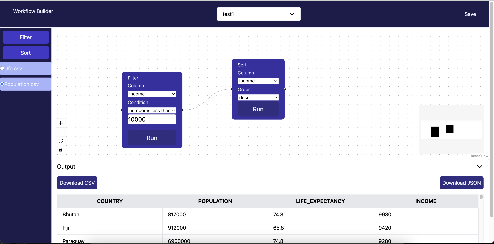

# Workflow Builder

**Project Description**
Workflow Builder application where users can create, edit, and visualize different workflows. Each workflow consists of multiple steps (nodes) and the relationships (edges) between them. Users should be able to drag and drop different types of nodes (e.g., filter, find, reduce, map, array methods) onto a canvas, and then draw lines between them to represent the workflow.
Task is to create a workflow building that performs dynamic operations on large amounts of data. You will have multiple CSVs in your local project. User can perform various operations on data to see final result on the CSV user has selected.

**Steps to use the app**

- User needs to create a new work flow by selecting new workflow from dropdown component in header.
- After the workflow is created user can drag and drop a node from left sidebar panel. Currently it supports only two array method. It can be improved to acommodate other array methods.
- User hase to select a file to perfrom the workflow.
- Now, if the user is finalized with workflow, it can be saved by the user by clicking on Save button on the header.

**Project Github link**

`https://github.com/nilesh-yadav-au6/workflow-builder`

**Step to install the project local machine**

- Clone the repo by using project link
- After project is cloned then do the following steps
- `cd workflow-builder`
- `npm install`
- `npm run dev`

**Tech Stack**

- React, Redux-Toolkit, Typescript

**Learing from the project**

- `React-flow`
- `Drag and Drop`
